# PeakNavApp

[PeakNav](https://peaknav.com) is an app to view world mountains in 3D.

Explore the mountains, see paths and ways projected onto their 3D shapes, as well as the names of the nearby peaks!

Currently available both as mobile app for Android and Desktop app.

<iframe width="560" height="315" src="https://www.youtube.com/embed/y4WspQmcwQw?si=OhTLQxpW3ncb3jTb?autoplay=0" title="YouTube video player" frameborder="0" allow="accelerometer; clipboard-write; encrypted-media; gyroscope; picture-in-picture; web-share" referrerpolicy="strict-origin-when-cross-origin" allowfullscreen=""></iframe>

## Datasets

This app works with data of two datasets (currently hosted on HuggingFace repository):

* [global-elevation-aster-slippy-tiles-tar-gz](https://huggingface.co/datasets/PeakNav/global-elevation-aster-slippy-tiles-tar-gz) contains the ASTER elevation dataset with a clever compression algorithm, retiled according to the [slippy tiles](https://wiki.openstreetmap.org/wiki/Slippy_map_tilenames) convention.
* [global-openstreetmap-extraction-slippy-tiles-tar](https://huggingface.co/datasets/PeakNav/global-openstreetmap-extraction-slippy-tiles-tar) contains data extracted from OpenStreetMap, also retiled according to the slippy map convention.

## Gallery

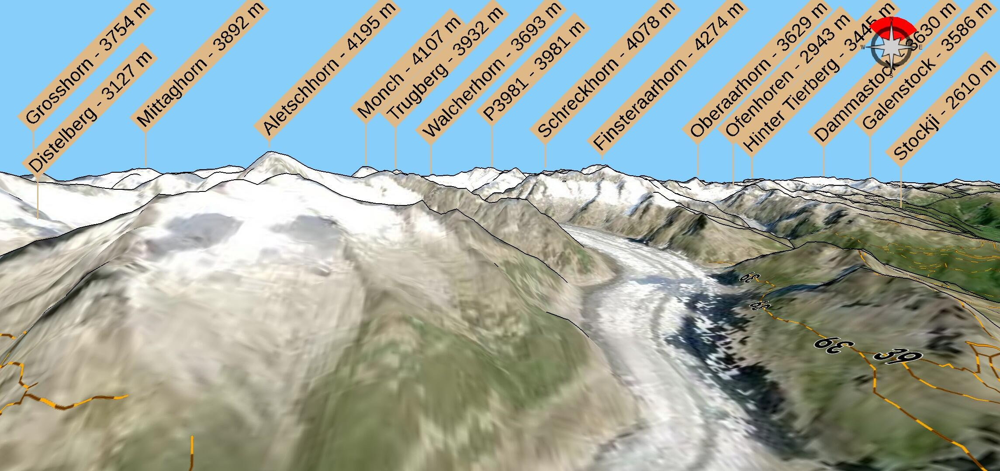
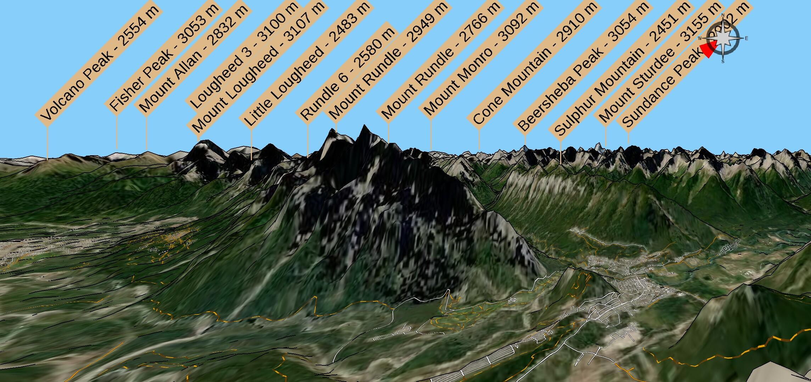
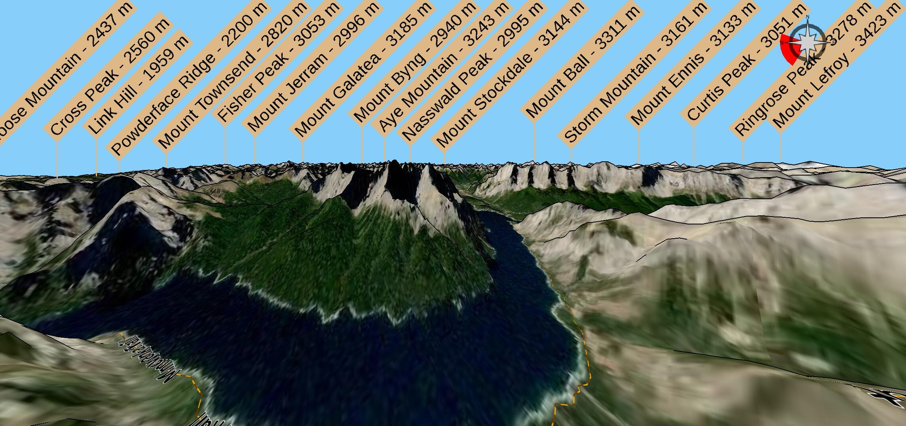
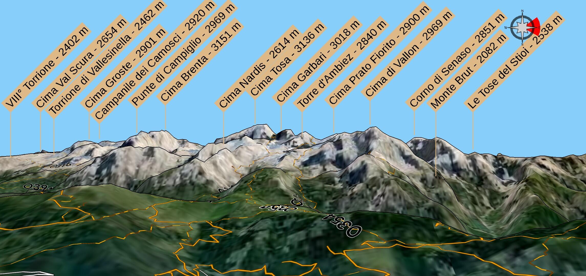
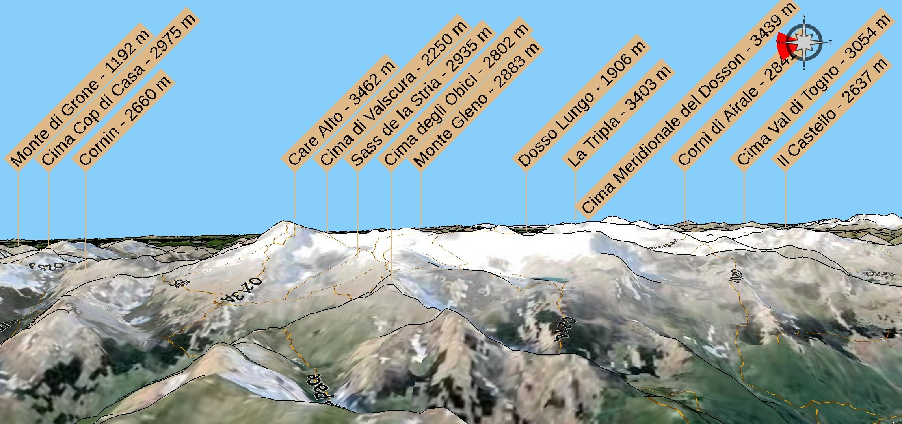
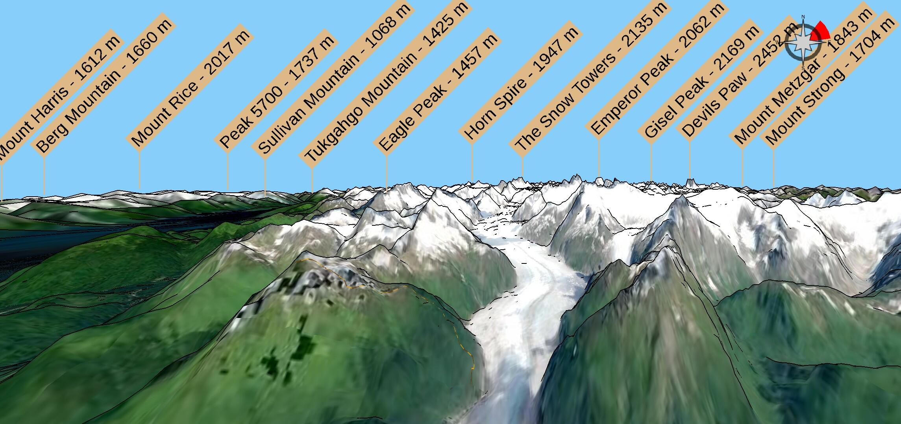
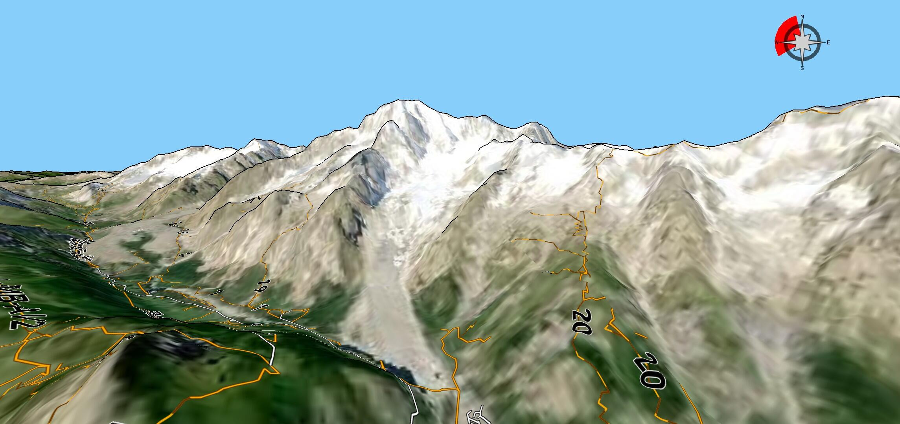
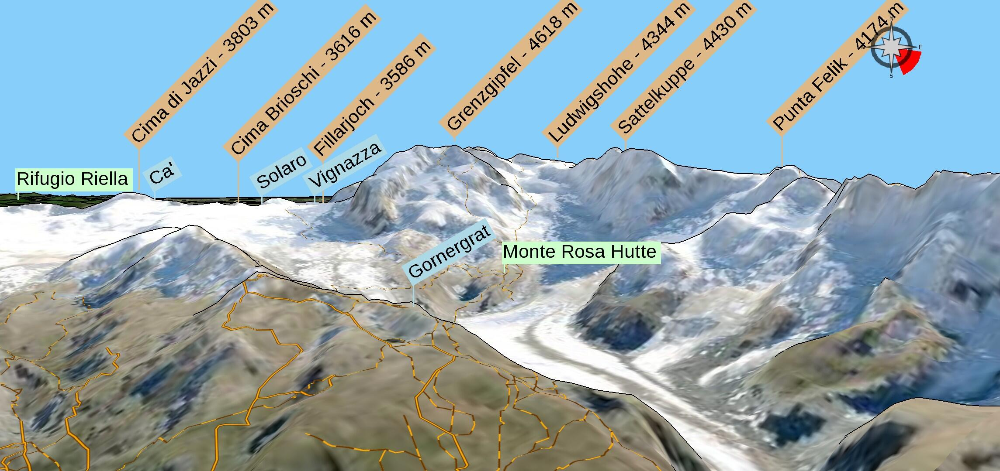
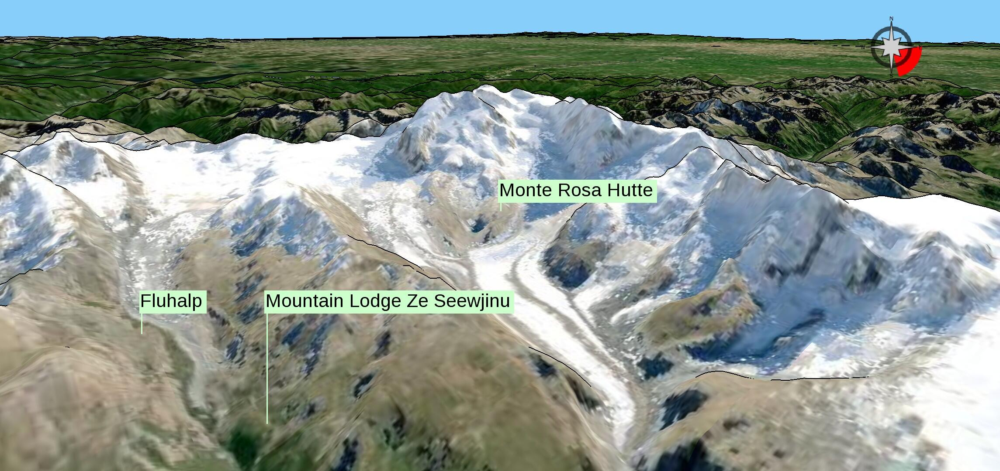
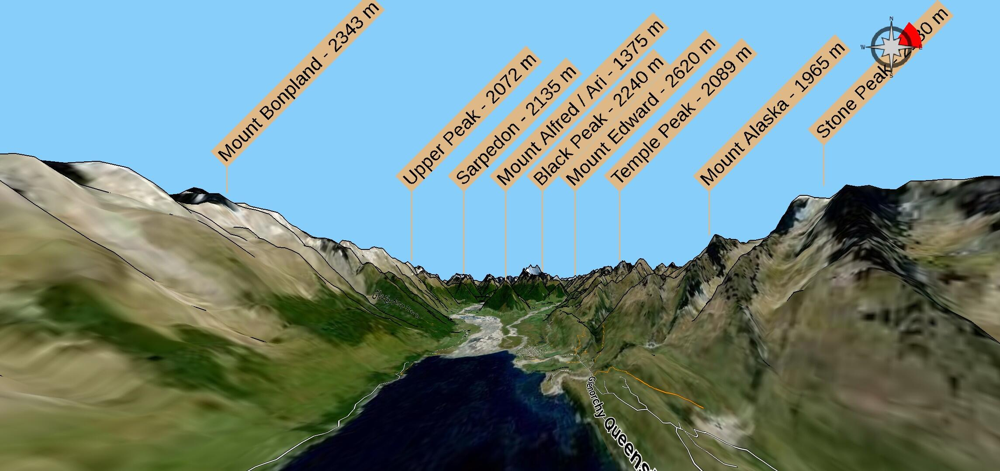
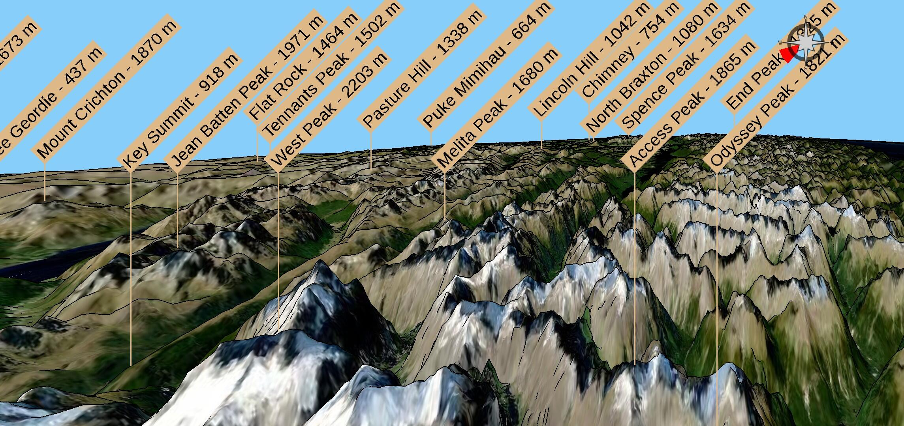
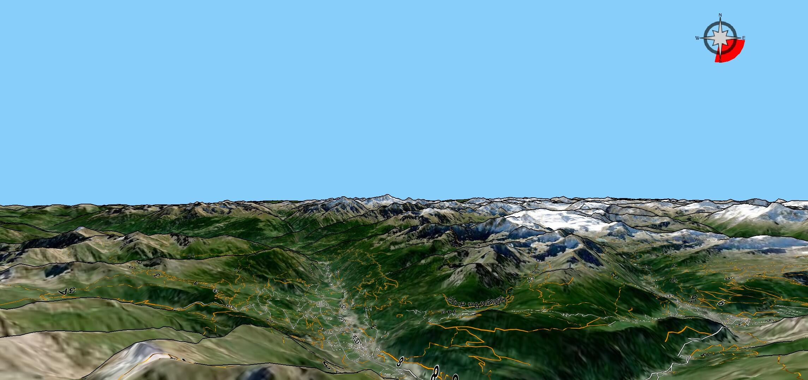

## Build

To build the project, follow these steps:

* Download the [Liberation Fonts](https://github.com/liberationfonts/liberation-fonts) .ttf files and extract them into the `./assets/liberation_fonts/` folder.
* Convert all .svg files located in `./assets_nonshared/icons/` to .png format, and place the resulting files in the `./assets/icons/` folder.
* Create an Apache Lucene search index for geographical names and store it in the `./assets/geonames_index.362/` folder.
  * Use Apache Lucene version 3.6.2 (the last version compatible with Android).
  * Include the following string fields in the index: _name_, _asciiname_, _lat\_store_, _lon\_store_, and _population\_store_.
  * Refer to `./core/src/test/java/TestLuceneGeonames.java` for an example of how to generate the index.
* Build the project with Gradle — this process is straightforward when using Android Studio, and supports both Android and Desktop builds.
