# PeakNavApp

[PeakNav](https://peaknav.com) is an app to view world mountains in 3D.

Explore the mountains, see paths and ways projected onto their 3D shapes, as well as the names of the nearby peaks!

Available for **Android**, **Windows**, **macOS** and **Linux**.

<!-- GitHub's markdown sanitizer drops `style` and `class` attributes, so the badge is
     sized with the `width` attribute, which it does keep. -->
[](https://play.google.com/store/apps/details?id=com.peaknav)

<!-- An <iframe> is stripped entirely by GitHub, so the video is a thumbnail that links
     to YouTube instead of an embedded player. -->
[](https://www.youtube.com/watch?v=y4WspQmcwQw)

## Download

**Android** — [Google Play](https://play.google.com/store/apps/details?id=com.peaknav)

**Desktop** — [the latest release](https://github.com/Upabjojr/PeakNavApp/releases/latest):

| Platform | File |
| --- | --- |
| Windows 10/11 (64-bit) | `peaknav-<version>-windows-x64-setup.exe` |
| macOS, Apple silicon | `peaknav-<version>-macos-aarch64.dmg` |
| macOS, Intel | `peaknav-<version>-macos-x86_64.dmg` |
| Debian / Ubuntu | `peaknav_<version>_amd64.deb` |
| Any other Linux | `peaknav-<version>-x86_64.AppImage` |
| Anything else, or you already have Java | `peaknav-<version>.jar` |

Every desktop download bundles its own Java runtime, so **no Java installation is
required**. The `.jar` is the exception — it needs Java 17 or later
(`java -jar peaknav-<version>.jar`) — and it is also the only build that covers ARM
and 32-bit machines, which have no installer of their own.

The desktop builds are not code-signed yet, so the first launch needs one extra step:
on Windows, SmartScreen shows "Windows protected your PC" — click *More info*, then
*Run anyway*; on macOS, right-click the app and choose *Open* rather than
double-clicking. Downloaded maps and settings are kept outside the installation
(`%APPDATA%\PeakNav`, `~/Library/Application Support/PeakNav`, or `~/.peaknav`), so
upgrading or reinstalling never costs you your data.

## Python package

PeakNav is also on PyPI, as [`peaknav`](https://pypi.org/project/peaknav/):

```bash
pip install peaknav
```

Three modules, in increasing order of what they need from the machine:

* **`peaknav.terrain`** — the elevation of any coordinate on Earth, in pure Python
  (one dependency: Pillow). It reads the same compressed ASTER dataset the app
  renders — with summit heights corrected against surveyed values — downloading
  tiles per area and caching them locally.

  ```python
  >>> from peaknav.terrain import elevation_at
  >>> elevation_at(45.9417, 7.7480)          # the Breithorn
  4160
  ```

* **`peaknav.headless`** — the real PeakNav renderer running off-screen, driven
  from Python: camera control, view options, rendered frames — for scripted
  snapshots, panoramas and videos. Needs Java 17+ and a display; the renderer jar
  (`peaknav-headless-<version>.jar`, attached to every
  [GitHub release](https://github.com/Upabjojr/PeakNavApp/releases)) is downloaded
  on first use, verified against a pinned digest, and cached — or point
  `$PEAKNAV_HEADLESS_JAR` at your own build. The renderer speaks plain HTTP
  (self-described at `/openapi.json`), so anything that can `curl` can drive it too.

  ```python
  from peaknav.headless import PeakNavHeadless

  with PeakNavHeadless(45.9763, 7.6586) as nav:
      nav.look(bearing_deg=230, pitch_deg=-4)
      nav.set_altitude_asl(3200)
      nav.save_frame("matterhorn.png")
  ```

* **`peaknav.jupyter`** *(experimental)* — an interactive PeakNav view inside a
  Jupyter notebook, with pan/tilt controls, altitude, coordinates and display
  toggles (`pip install "peaknav[jupyter]"`).

The package sources, example notebooks and developer documentation live in
[`peaknav-python/`](./peaknav-python/).

## Datasets

This app works with data of two datasets (currently hosted on HuggingFace repository):

* [global-elevation-aster-slippy-tiles-tar-gz](https://huggingface.co/datasets/PeakNav/global-elevation-aster-slippy-tiles-tar-gz) contains the ASTER elevation dataset with a clever compression algorithm, retiled according to the [slippy tiles](https://wiki.openstreetmap.org/wiki/Slippy_map_tilenames) convention.
* [global-openstreetmap-extraction-slippy-tiles-tar](https://huggingface.co/datasets/PeakNav/global-openstreetmap-extraction-slippy-tiles-tar) contains data extracted from OpenStreetMap, also retiled according to the slippy map convention.

## Gallery

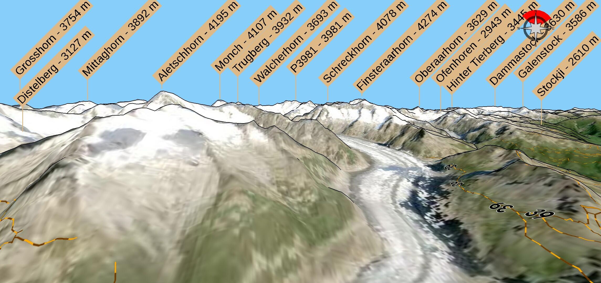
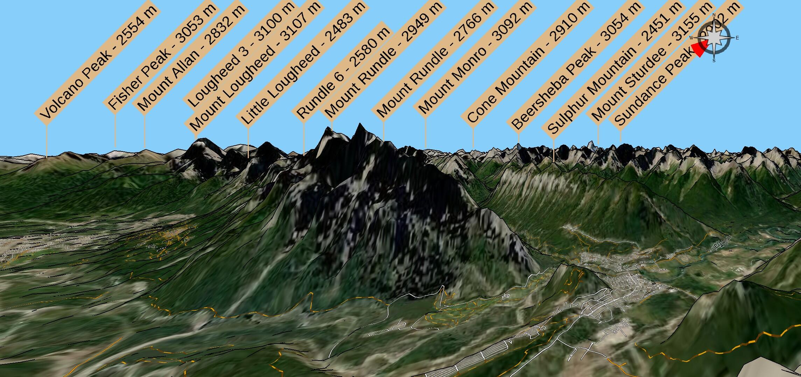
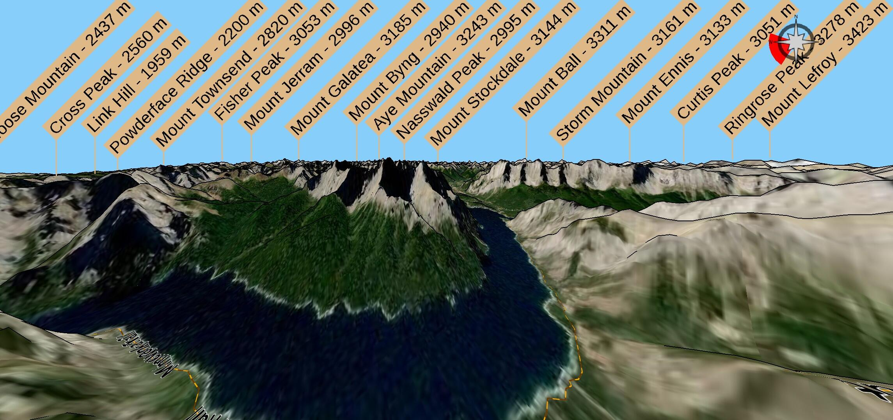
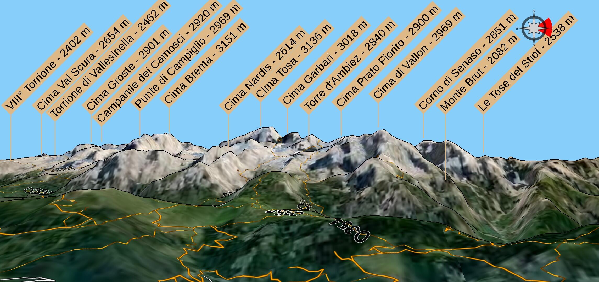
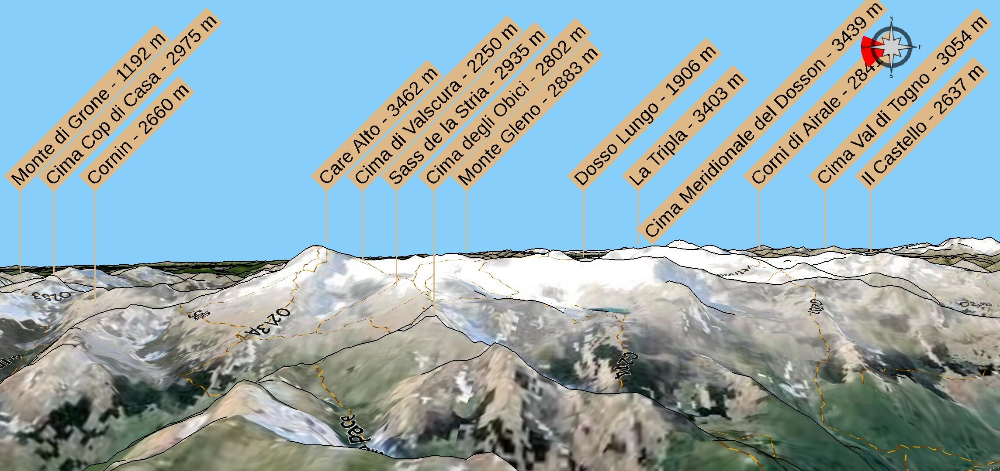
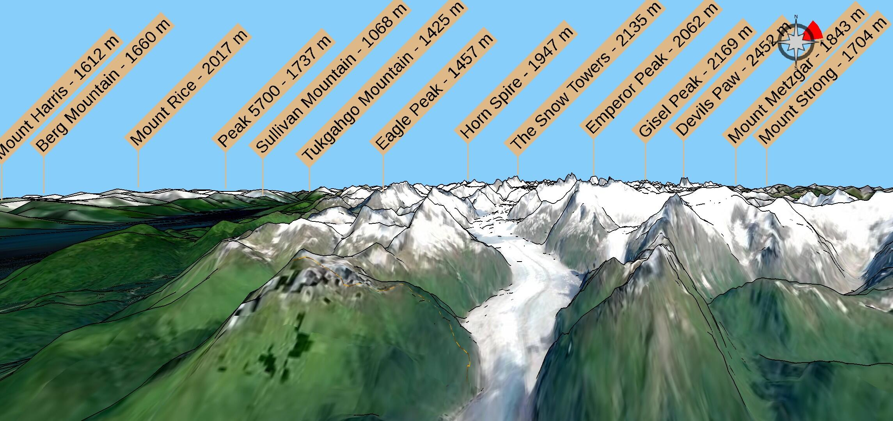
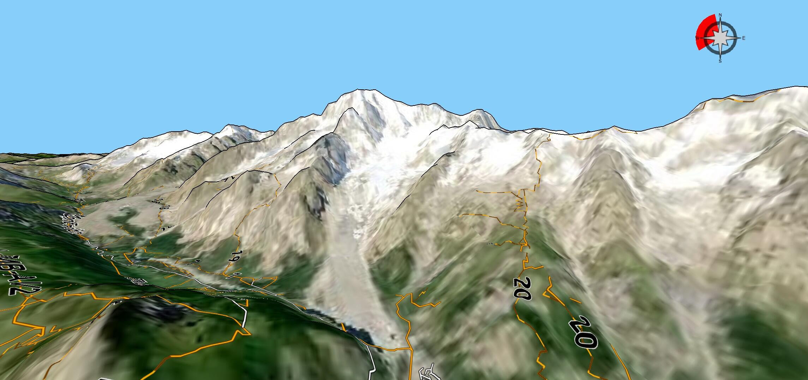
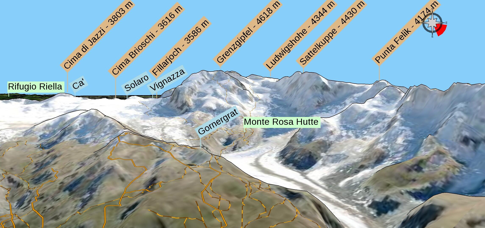
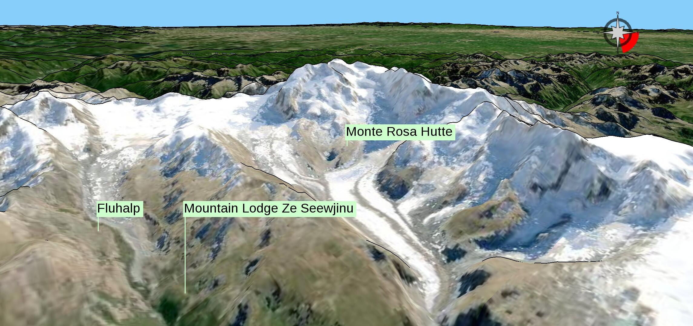
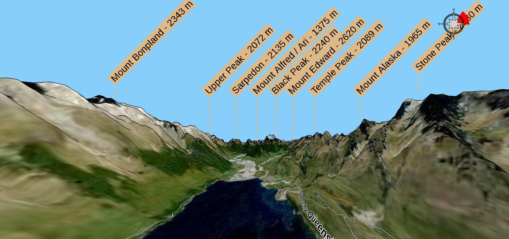
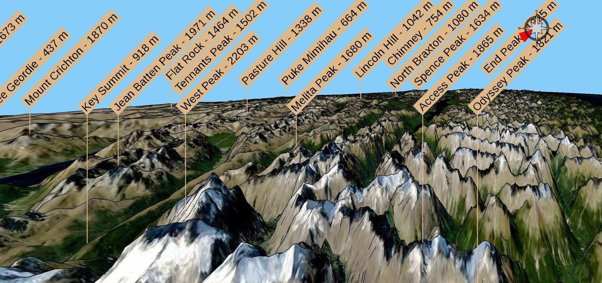
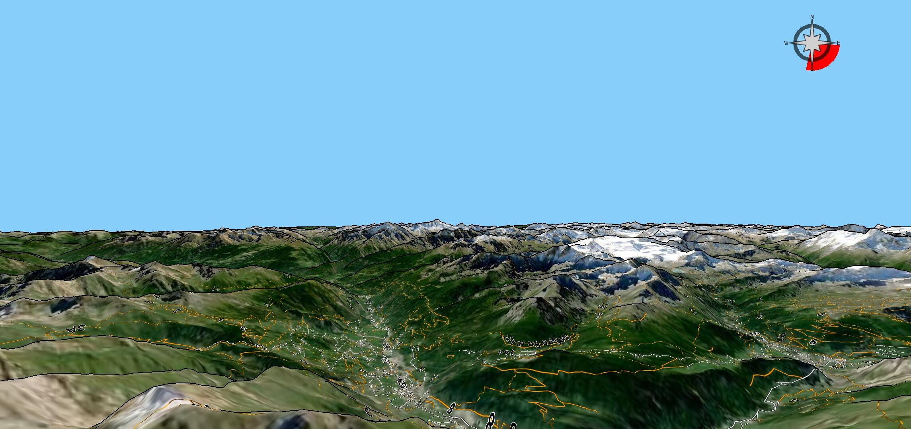

## Build

To build the project, follow these steps:

* Download the [Liberation Fonts](https://github.com/liberationfonts/liberation-fonts) .ttf files and extract them into the `./assets/liberation_fonts/` folder.
* Convert all .svg files located in `./assets_nonshared/icons/` to .png format, and place the resulting files in the `./assets/icons/` folder.
* Build the Apache Lucene search index for geographical names into `./assets/geonames_index.362/`.
  Download `cities500.txt` and `alternateNamesV2.txt` from
  [GeoNames](https://download.geonames.org/export/dump/), then:

  ```bash
  ./gradlew :core:buildGeonamesIndex \
      --args="cities500.txt alternateNamesV2.txt assets/geonames_index.362"
  ```

  * Lucene is pinned to 3.6.2, the last version compatible with Android — don't bump it.
  * The index carries the string fields _name_, _asciiname_, _lat\_store_, _lon\_store_ and
    _population\_store_. Each place is one document whose _name_ field holds every name it can
    be searched by — the local form, a selection of translations, and accent-free spellings —
    so "Venezia" and "Venice" both find the same city and the stored data is paid for once.
  * The builder lives in its own source set, `core/src/tools/java`, so none of it ships in the
    app.
  * Mountain peaks can then be added from OpenStreetMap extracts ([Geofabrik](https://download.geofabrik.de/)
    `.osm.pbf` files), without rebuilding from the GeoNames dumps:

    ```bash
    pip install osmium
    python3 tools/extract_osm_peaks.py peaks.tsv /path/to/pbf_dir
    ./gradlew :core:addPeaksToIndex --args="peaks.tsv assets/geonames_index.362"
    ```

    A third argument sets a minimum elevation; peaks with a Wikipedia article are kept
    regardless of it. Search results show peaks with their elevation — "Matterhorn (4478 m)" —
    and rank them below any city sharing their name.
* Build the project with Gradle — this process is straightforward when using Android Studio, and supports both Android and Desktop builds.

### Headless renderer

The [`headless/`](./headless/) module builds the app as a library that draws off-screen,
for producing views from code instead of from a person at a keyboard — screenshots,
panoramas, videos, documentation images:

```bash
./gradlew :headless:renderJar    # standalone fat jar, no Gradle needed to run it
java -jar headless/build/libs/peaknav-headless-<version>.jar \
    --lat 46.0207 --lon 7.7491 --bearing 210 --out matterhorn.png
```

The same jar is attached to every [GitHub release](https://github.com/Upabjojr/PeakNavApp/releases)
as `peaknav-headless-<version>.jar`, so rendering from a script does not require building
the project. It still needs a display connection (the window is created hidden, but GL
needs one), and `--serve [port]` starts a REST server describing itself at
`/openapi.json`, so it can be driven from Python — or anything that speaks HTTP. Given
together with `--frame`, the server runs alongside the frame loop instead of replacing
it, so a script can watch a video render — `GET /objects` lists the peaks, huts, places
and area labels the renderer has loaded and which of them are on the current frame
(`snapshots/generate_videos.py --probe` does exactly that). `--gpx <file>` draws a GPX
track on the terrain and `--fov` sets the lens. The
`peaknav` Python package, described in the [Python package](#python-package) section
above, is exactly such a client; see [`headless/README.md`](./headless/README.md) for
the Java API and implementation notes.

### Photo skyline matching

When a photograph is placed behind the terrain (gallery or camera buttons) and the app
knows where it was taken, it tries to work out which way the camera pointed: the skyline
traced in the picture is matched against the terrain's horizon around that spot, and if
the match is unambiguous the app offers to turn its camera to the same bearing, pitch and
field of view, so the mountains line up with the photo. While a photo is shown, a quick
double tap pins the terrain under the finger to that spot of the picture (a red ring marks
it); dragging then turns the terrain around the pin and pinching zooms with the pin held,
which is how a summit is fixed first and the rest lined up by hand (another double tap, or
the unpin button that appears above the elevation bar, releases the pin). A single tap does not
pick a point to fly or orbit to while a photo is up. The terrain is drawn as outlines only
over the photo; the vertical bar above the share button fades the rendered terrain in, up
to opaque, and the photo bar at the bottom holds the match button, the outline-visibility
bar and the X that closes the picture. A button on the photo's control
bar does the same on demand - at the current position, whether or not the match is
sure - for photos without a location, a moved view, or a suggestion that never came.
Classical image processing, a small learned pixel classifier (a forest of decision
trees, no neural network) and plain optimisation; the code is `com.peaknav.skyline` in
`core`.

How well it works is measured on photographs with a known camera heading, which
`tools/skyline_dataset.py` gathers - from [GeoPose3K](https://cphoto.fit.vutbr.cz/geoPose3K/)
(exact poses, a 38 GB download you point the script at) or from Wikimedia Commons photos
whose location template carries a `heading:` (downloaded on the spot, with their licences
recorded) - and the `skylineBenchmark` task reports:

```bash
python3 tools/skyline_dataset.py commons --category "Mountains of Switzerland" --limit 60
./gradlew :core:skylineBenchmark --args="~/.peaknav/skyline_dataset/commons/manifest.json"
./gradlew :core:skylineBenchmark --args="--annotate out/ path/to/manifest.json"   # + one PNG per photo
```

With `--annotate`, every photo is also written out with the traced skyline in red, the
matched pose's ridge in green and the truth pose's ridge in blue, plus an `index.html`
listing them - the quickest way to see where the extractor goes wrong.

Debug builds have one more button on the photo bar: it saves the current photo with the
camera's pose and the terrain overlay as a dataset sample (`skyline_samples/` in the app's
private storage, with a `manifest.json` the benchmark reads directly) - line the picture up
by hand, press it, and the pose at that moment becomes that photo's truth. From a phone:

```bash
adb exec-out run-as com.peaknav.debug tar c files/skyline_samples > samples.tar
./gradlew :core:skylineBenchmark --args="skyline_samples/manifest.json"
```

On the desktop the button appears with `-Dpeaknav.debug=true` and writes to
`~/.peaknav/skyline_samples/`.

On GeoPose3K's 339 hand-posed photos the bearing comes out within 10 degrees for 62% of
them (49% with the classical extractor), and when the matcher calls a match confident -
the only case in which the app asks - it is right 97% of the time, for 98 of the 339
photos (was 70). On the hand-traced skylines of the CH1 and web sets the whole skyline
is within 5 px of the truth for 94% and 95% of the pictures (51% and 90% classical); the
residual misses are haze, where a faint far range stands above a stronger near ridge.
The elevation tiles of the photographed areas must be on disk (the app's own
`~/.peaknav` cache, or the Python package's).

The hard part is not the matching but telling sky from ground in the picture - snow from
cloud, a hazy far ridge from the sky it stands against. Two gradient-boosted forests do
that (`SkyClassifier`, plain threshold comparisons, shipped as resources next to it):
the first gives every pixel a sky probability from 42 hand-designed features
(`SkyFeatures`: colour, position, edges at several scales and relative to the local
contrast, texture, the pixel against a per-column model of the sky, and what lies above
it in its column); the second scores every position as "the skyline passes here" from
what lies just above and below it (`BoundaryFeatures`). The path search then blends the
boundary probability with the image gradient and keeps the sky/ground region terms
capped, so a glare or cloud blob above the ridge cannot outweigh the ridge's edge. The
design and its constants come from the skyline study kept with the dataset
(`study/ALGORITHM.md`, `study/REPORT.md`). Retraining uses the app's own feature code
to write the rows, so training and inference cannot disagree:

```bash
./gradlew :core:skylineTrainingDump --args="--ridge geopose3k/manifest.json ridge.jsonl"   # truth ridges, once
./gradlew :core:skylineTrainingDump --args="--from-ridge ridge.jsonl rows.csv.gz --exclude-manifest geopose3k_manual/manifest.json --exclude-prefix eth_ch1_"
python3 tools/skyline_train.py rows.csv.gz --trees 300 -o core/src/main/resources/com/peaknav/skyline/sky_model.bin --check check.csv
./gradlew :core:skylineTrainingDump --args="--check core/src/main/resources/com/peaknav/skyline/sky_model.bin check.csv"
./gradlew :core:skylineTrainingDump --args="--boundary-rows core/src/main/resources/com/peaknav/skyline/sky_model.bin ridge.jsonl rows2.csv.gz --exclude-manifest geopose3k_manual/manifest.json --exclude-prefix eth_ch1_"
python3 tools/skyline_train.py rows2.csv.gz --trees 300 -o core/src/main/resources/com/peaknav/skyline/boundary_model.bin
```

The hand-posed photos and the CH1 pictures are kept out of training: they are the test
sets. Rows can also come from pictures with a sky mask
(`--mask-set dir` with `images/` and `ground_truth/<stem>-mask.png`).

The extractor alone is scored on hand-traced skylines (the CH1, Basalt Hills and Web sets
of Ahmad et al., IJCNN 2021) by `./gradlew :core:skylineMaskEval --args="[--annotate out/] dataset/CH1/cvg ..."`,
which counts, per picture, the columns where the traced line is grossly off - on a cloud
or a snow-line rather than the ridge - since a few pixels either way do not matter.

### Desktop installers

```bash
./gradlew :desktop:installers
```

Produces all of the downloads listed above into `desktop/build/installers/`: the Windows
setup executable, both macOS disk images, the Debian package and the AppImage. They are
built with construo (application image plus a bundled JRE 17) wrapped by NSIS,
genisoimage, dpkg-deb and mksquashfs — all of which cross-compile, so every artefact can
be produced from a single machine whichever OS it runs. Needs `nsis`, `genisoimage` and
`squashfs-tools` installed; see [`desktop/packaging/README.md`](./desktop/packaging/README.md)
for details and the signing caveats.

## License

The source code and assets are licensed under the
[GNU General Public License, version 3](https://www.gnu.org/licenses/gpl-3.0.html) —
Copyright © Francesco Bonazzi. See [LICENSE](./LICENSE).

Three things are **not** covered by it: the name **PeakNav**, the PeakNav logo, and the
application launcher icon — see [TRADEMARK-AND-ASSETS.md](./TRADEMARK-AND-ASSETS.md).
Everything else, the interface icons and the rendered images included, is under the GPL. You
may fork and publish the code freely under your own name and launcher icon.

The map data, terrain, imagery and third-party libraries it builds on carry their own
licenses and attribution requirements, listed in
[THIRD_PARTY_LICENSES.md](./THIRD_PARTY_LICENSES.md) and reproduced on the app's own
License page.
